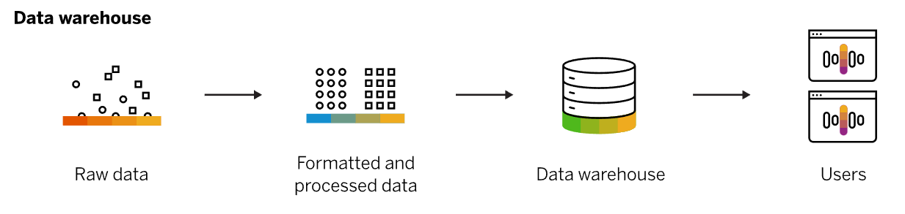

## Estudos sobre Data Warehouse

### O que são Data Warehouses?

Data warehosues são sistemas de armazenamento centrais, que irão receber dados de outras fontes, como banco de dados tradicionais, e irão organizar os dados para uma rápida análise.

Geralmente os DW's são construídos com um foco, ou seja, para um objetivo, como popular um BI, popular um relatório, entre outros.

Vão existir algumas arquiteturas e algumas técnicas para modelar e analisar os dados contidos dentro dos data warehouses. 

Por exemplo, para se lidar com dados geoespaciais, é preciso fazer mudanças na arquitetura e soluções utilizadas no DW para que ele vire um Spatial DW.

Geralmente você vai ter um data lake mais genérico, contendo mais dados e vai ter um data warehouse que irá ter um recorte desse DL.

### Do que se constitui um DW?

* Fontes de dados (BD relacionais e etc)
* Soluções de ETL para preparar os dados
* Serviços de Metadados
* Recursos de análise estatística
* Front-end para visualização dos dados (um BI da vida) &rarr; OLAP

### Benefícios de um DW

* Manter dados históricos, possibilitando análise temporal
* Dados estáveis, de modo que se entraram no data warehouse, os dados não irão mudar
* Realizar análise de dados em grandes quantidades
* Orientado para o assunto

A ideia do benefício geral de um DW é oferecer análises/consultas rápidas nas grandes quantidades de dados relacionadas a um tópico/contexto.

#### Data Marts e Data Lake

Data Marts são ainda mais específicos que o Data Warehouse. Enquanto os DWs seriam os repositórios centrais da empresa, o Data Mart seria especificamente de um departamento, por exemplo.

Data lakes são mais genéricos que o DW, de modo que vão conter todos os tipos de dados, em diversos formatos e etapas. Servem como fonte para os DWs.

### Arquitetura de DW

DWs podem ser dividios em camadas:

* **Camada de dados**: onde os dados são extraídos e carregados utilizando ELTs, de modo que irão puxar dados de outros SGBDs, por exemplo.

* **Camada semântica**: Reestruturação dos dados para consultas mais rápidas e para possibilitar as análises

* **Camada de análise**: Acesso aos dados por meio dos usuários, com dashboards de visualização e etc.

#### Star Schemas

### DW Espaciais

### ETL Espaciais em DW