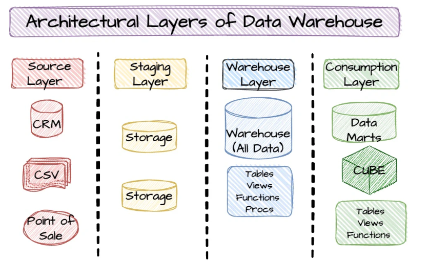
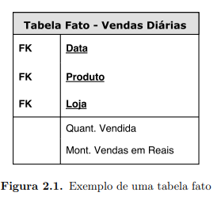
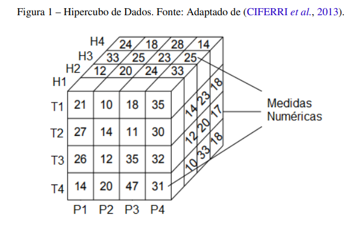
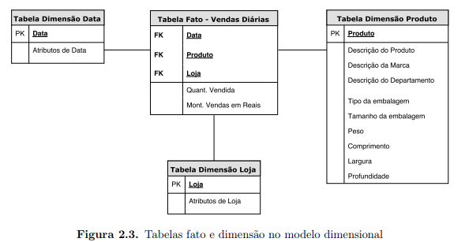
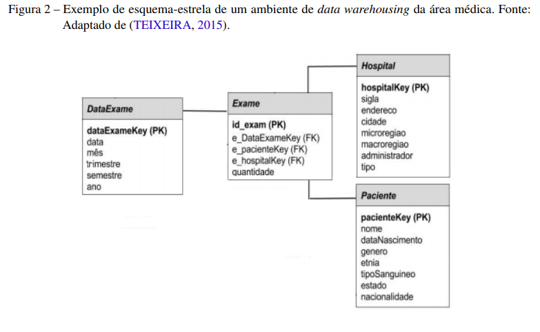

## Estudos sobre Data Warehouse

### O que são Data Warehouses?

Data warehosues são sistemas de armazenamento centrais, que irão receber dados de outras fontes, como banco de dados tradicionais, e irão organizar os dados para uma rápida análise.

Geralmente os DW's são construídos com um foco, ou seja, para um objetivo, como popular um BI, popular um relatório, entre outros.

Vão existir algumas arquiteturas e algumas técnicas para modelar e analisar os dados contidos dentro dos data warehouses. 

Por exemplo, para se lidar com dados geoespaciais, é preciso fazer mudanças na arquitetura e soluções utilizadas no DW para que ele vire um Spatial DW.

Geralmente você vai ter um data lake mais genérico, contendo mais dados e vai ter um data warehouse que irá ter um recorte desse DL.

### Do que se constitui um DW?

* Fontes de dados (BD relacionais e etc)
* Soluções de ETL para preparar os dados
* Serviços de Metadados
* Recursos de análise estatística
* Front-end para visualização dos dados (um BI da vida) &rarr; OLAP

### Benefícios de um DW

* Manter dados históricos, possibilitando análise temporal
* Dados estáveis, de modo que se entraram no data warehouse, os dados não irão mudar
* Realizar análise de dados em grandes quantidades
* Orientado para o assunto

A ideia do benefício geral de um DW é oferecer análises/consultas rápidas nas grandes quantidades de dados relacionadas a um tópico/contexto.

#### Data Marts e Data Lake

Data Marts são ainda mais específicos que o Data Warehouse. Enquanto os DWs seriam os repositórios centrais da empresa, o Data Mart seria especificamente de um departamento, por exemplo.

Data lakes são mais genéricos que o DW, de modo que vão conter todos os tipos de dados, em diversos formatos e etapas. Servem como fonte para os DWs.

### Arquitetura de DW

DWs podem ser dividios em camadas:

* **Camada de dados**: onde os dados são extraídos e carregados utilizando ELTs, de modo que irão puxar dados de outros SGBDs, por exemplo.

* **Camada de staging**: onde são feitas as operações de ETL para transformar os dados

* **Camada semântica**: Reestruturação dos dados para consultas mais rápidas e para possibilitar as análises

* **Camada de análise**: Acesso aos dados por meio dos usuários, com dashboards de visualização e etc.

A ideia aqui é ter na camada de dados coisas como batch e streaming, que irão ser salvos no staging, onde serão realizadas na camada semântica as operações de ETL necessárias para salvar no Data Warehouse que depois será acessado pelos usuários na camada de análise.

### Modelagem

Star Schemas são uma das formas mais comuns de se modelar um DW, dado que cria multidimensões. Multidimensões são importantes para dar uma característica de diferentes níveis de agregação de dados, de modo que aumenta a performance.

Dois conceitos importantes no Star Schema são os de **Facts** e **Dimensions**.

* Facts: São representações de acontecimentos no DW. Por exemplo, uma venda.
* Dimensions: Representam as entidades relacionadas a um fato. Por exemplo, o nome do vendedor, o produto e o valor são entidades de uma venda.

Facts representam uma medida do negócio da empresa, sendo a intersecção de diversas dimensões. É como se fosse uma "análise" de diversas tabelas de dimensões.

Por exemplo, um Fact pode ser uma tabela de venda do dia, que irá ter métricas como quantidade de produtos vendidos e valor total arrecadado, além de FK como "Data", "Produto" e etc. Ela irá agregar as informações de outras tabelas como a tabela de vendas e etc e irá já gerar uma "análise".

Armazena-se sempre uma medida, quantidade de produtos em um dia, quantidade de exames. Sempre a ideia é você extrair uma consulta, popular um BI.

As dimensões são o que eu irei precisar para realizar essas consultas.

Considerando a coordenada (P1, T1, H1), significa que foram realizados 21 exames no paciente 1, no trimeste 1 e no hospital 1

#### Aggregation Levels

Atributos de dimensões podem ter um nível de relacionamento, compondo hierarquias nos dados. Essa noção de *hierarquia* é importante em DWs, de modo que quao mais baixo você está na hierarquia, maior o nivel de detalhamento.

#### Formas de modelar

Existem alguns tipos de modelagem que podem ser feitas: Multidimensional, Relacional, Hibrida

As duas formas de modelar mais famosas são o star schema e o snow-flake. Sempre são compostos de uma tabela de Facts central e várias tabelas satélites de Dimensions.

O Star Schema é o principal, tendo uma tabela de fatos com uma única tabela para cada dimensão. Já o snowflake, é uma variação do star schema em que as tabelas de dimensões são organizadas em hierarquias.

Exemplo de esquema estrela com tabelas de fatos e de dimensões:

### Star Schema

Tabela de fatos no centro, geralmente com poucas linhas mas muitas colunas (muitos dados). Armazena as medidas e as referências (FK) para as tabelas de dimensão. A PK é uma chave composta das FKs

As tabelas de dimensão ficam na borda e apresentam dados não normalizados

### Snowflake

Diferença é que os dados hierarquicos são normalizados, não ocorrendo redundâncias. Apenas a hierarquia de menor granularidade que é ligada a tabela de fatos.

Retirar a redundância diminui o tamanho, mas pode piorar a performance se for necessário vários joins para se ter um bom desempenho

Exemplo de hierarquia:

Trimeste > Semestre > Ano
### DW Espaciais

DW espaciais serão basicamente DWs que irão ter o suporte tanto para operações não-espaciais quanto para operações espaciais, podendo armazenar dados espaciais. 

O fluxo de criação de um SDW é basicamente:

* Extrair os dados.
* Realizar a modelagem multidimensional do DW
* Transformar os dados para serem representados na modelagem
* Carregar os dados no DW
* SOLAP para visualização 

### Operações OLAP em DW
