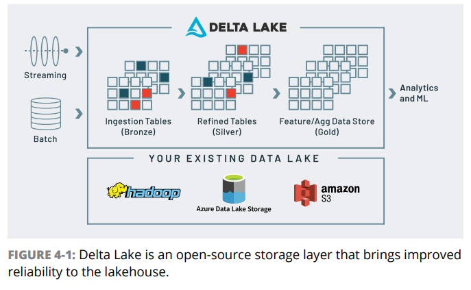

# Delta Lake + Data Lakehouse + Data Bricks

Lakehouses irão utilizar cloud object storages de baixo custo com alta capacidade de escalabilidade. O Delta Lake vai funcionar em cima desses object storages, oferecendo funcionalidades como indexação, layouts, transações ACID e etc.

> "Building a central, reliable, and efficient single source of truth for data in an open format for use cases ranging from BI to ML with decoupled storage and compute is the foundation of the lakehouse approach"