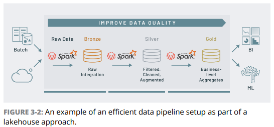
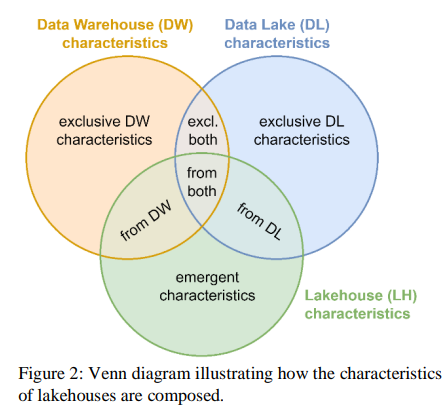

# Data Lakehouse

Fonte Principal: The Data Lakehouse for Dummies do Databricks

## Contexto para uso

As empresas tinham duas soluções de arquitetura para utilizarem: Data Warehouses e Data Lakes.

Porém, cada uma delas tinha suas limitações, de modo que muitas vezes era necessário que as empresas mantivessem as duas arquiteturas funcionando e se sincronizando.

Os Data Warehouses ofereciam um bom suporte para consultas SQL, relatórios de BI, mas não tinham a capacidade de lidar com dados não estruturados. Também apresentavam alto custo de operação, pouca flexibilidade e pouca escalabilidade. Não eram muito aplicáveis no contexto de Big Data

Os Data Lakes entraram para suprir a necessidade Big Data de grandes volumes e grande variedades de dados (estruturados, semi-estruturados e não estruturados). Eles possibilitaram o baixo custo, a escalabilidade e flexibilidade que o DW não ofertava. Porém, alguns fatores que eram presentes no DW, como data quality, consistência de dados, isolamento de dados, entre outros fatores não estavam presentes, ou eram muito custosos de serem aplicados.

Além disso, temos o contexto da necessidade de lidar com dados em tempo real, dados de streaming, dados não estruturados, entre outros fatores. Tudo isso enquanto ainda mantemos confiabilidade, segurança, qualidade nos dados.

Uma das soluções era se ter diversos sistemas de armazenamento que se conversavam de alguma forma, mas podemos imaginar que a complexidade de manter tudo conectado é alta.

## O que são Data Lakehouses

Temos o seguinte cenário:

* Data Warehouses com pouca escalabilidade e flexibilidade
* Data Warehouses sendo altamente custosos
* Data lakes com baixo custo, mas com pouca confiabilidade
* Data lakes sem apresentar Data Quality
* Necessidade de lidar com volume e variedade de dados
* Necessidade de atender demandas de BI e de ML ao mesmo tempo

Basicamente tínhamos pontos positivos e negativos em ambas as arquiteturas e queríamos o melhor das duas.

Data Lakehouses surgem com a proposta de utilizar características de estrutura e gerenciamento de dados de Data Warehouses em cima de armazenamentos low-cost dos Data Lakes. É um novo system design. 

Data Lakehouses são a nova tentativa de criar Data Warehouses agora que temos sistemas de armazenamentos low-cost disponíveis e consolidados.

Data Lakes foram possibilitados pela criação de sistemas de armazenamentos de baixo custo, como o HDFS, além de sistemas de Unified Analytics  Processing como o Spark/Hadoop. Os LakeHouses são na mesma pegada, novas tecnologias (como o Delta Lake) possibilitaram essa nova arquitetura.

### Problemáticas

Data Lakehouses são arquiteturas para prover tudo em uma única plataforma: BI, SQL, Data Science, ML e etc.

Em Data Lakes, temos desafios como:

* Adicionar dados enquanto lê pode causas problema na consistência de dados
* Modificar dados existentes pode ser custoso
* Jobs podem falhar e não serem percebidos
* Manter historical data versions é custoso
* Lidar com grandes quantidade de metadados é dificil
* Pode ter problemas de Data Quality
* Performance pode não ser muito boa e as técnicas para melhorar a performance são suscetíveis a erros

A partir disso, os Data Lakehouses usam a base de armazenamento low-cost dos Data Lakes, mas implementam atributos de Data Warehouse como confiabilidade, performance e qualidade, enquanto mantém o "openness" e escala dos DL.

Ja em Data Warehouses, temos desafios como:

* Lidar com o alto custo de operação
* Lidar com dados de streaming/dados em tempo real
* Lidar com dados voltados para ML/DS/Predição
* Escalabilidade e flexibilidade

### Data Lakehouses

Irão prover:

* ACID Transactions: As operações viram transacionais, de modo que se não forem concluídas serão abortadas e logs serão gerados.
* Possibilidade de data versions por meio de snapshots que tem operações como rollbacks
* Não são necessários softwares específicos de metadados, os metadados são dados normais que irão entrar com a capacidade de armazenamento e processamento (Spark)
* Indexação e outras técnicas para melhorar performance
* Flexibilidade e escalabilidade, dado que usa formatos abertos, contrariando o proprietário do Data Warehouse
* Unificação dos data silos/data management systems
* Reduzir o vendor lock-in

> Vendor lock-in é o termo dado quando você fica dependente de certas tecnologias ou de certo banco, de modo que se você quiser utilizar alguma outra forma, ou transferir, vai ter que ficar mantendo cópias ou não vai conseguir

## Benefícios de usar Lakehouse

Todos os dados são mantidos em formatos abertos (Parquet, principalmente) e as ferramentas utilizadas são flexíveis o suficiente para lidar com as principais demandas. O Spark integrado permite tanto que você faça queries SQL como faça análise usando Ciência de Dados.

> "With the lakehouse approach, you can build reliable data lakes by unifying data pipelines across both batch and streaming data. Lakehouses enable your efforts with regards to efficiently ingesting data, building scalable data pipelines, running them in production, and automating these cost-effective processes for simplicity, reliability, and scale."

#### Data Reliability

Um dos desafios que o Lakehouse se propõe a resolver é o data reliability. Os Data Lakes tem o desafio de manter a confiabilidade nos dados em um cenário que existirão diversas data pipelines realizando jobs, operações de write e de read, sem ter mecanismos que irão conferir uma confiabilidade para esses dados.

> O Delta Lake do Databricks entraria em cima do seu Data Lake, sendo uma "open source storage layer" para provar os princípios ACID, metadados escaláveis e processamento unificado de streaming e batch. Ele irá ter mecanismos que irão prover a data reliability.

## Arquitetura em Camadas

Vai ter a camada dos dados propriamente dita, dos object storages, onde serão utilizados formatos abertos como o Parquet. E teremos o lakehouse que é uma camada que irá ofertar, integrando-se com o object storage, as características de um Lakehouse.

Algumas das implementações existentes são: Delta Lake, Apache Iceberg e Apache Hudi.

Com a arquitetura atual de DL + DW das empresas, tem que ter um ETL pro Lake depois um ETL pro DW, o que pode levar a erros em vários lugares, que podem passar despercebidos.

Problematica do ML: Os frameworks precisam de grandes volumes de dados, enquanto o DW é focado em resultar pro usuário poucos volumes de dados. E não é possível acessar diretamente os dados que estão salvos no DW, precisando passar pela interface. Se você for jogar em arquivos, adiciona mais um ETL no processo

> "We define a Lakehouse as a data management system based on low-cost and directly-accessible storage that also provides traditional analytical DBMS  management and performance features such as ACID transactions, data versioning, auditing, indexing, caching, and query optimization. Lakehouses thus combine the key benefits of data lakes and data warehouses: low-cost storage in an open format accessible by a variety of systems from the former, and powerful management and optimization features from the latter."

>  "which refers to Delta Lake as a novel kind of “ACID table storage layer over cloud object stores”."

#### Metadata Layer

A primeira ideia proposta é você ter a base dos object storages de baixo custo, armazenando os dados em arquivos. Em cima disso, você vai ter uma camada de metadados, que vai ter um "controle" sobre esses arquivos

Essa tabela de metadados vai definir quais são os objetos que pertencem as tabelas. Então quem implementa as funcionalidades é a metadata layer, de modo que ainda mantém a capacidade de acessar diretamente os dados da object layer (fator que os SGBDs não permitem).

Essa camada é suficiente para adicionar funcionalidades de gerenciamento para o Data Lake. 

~~~
Hence, lakehouses must provide concepts that allow to compose structured data to relations on the logical level, such that multiple files in the storage system can jointly represent a cohesive data collection with relational properties, such as a table-like structure (cf.(Codd, 1990)). This can be achieved e.g. by storing and managing technical metadata that contains information about the available relations, their column names and the data files holding their tuples.
~~~

#### Data Quality

Com uma camada de metadados, surge o ambiente para você criar processos de data quality. Então essa camada, como irá manter o controle das tabelas e etc, pode criar constraints, schemas e etc.

#### Performance de SQL

* Caching: Lakehouse pode trazer dados dos object storage nodes para os processing nodes, armazenando em SSDs e RAM

* Data Layout: Ordenação ocorre por meio de dimensões individuais ou space-filling curves such as Z-Order and Hilbert Curves to provide locality across multiple dimensions. (NAO SEI O QUE SAO)

* Dados Auxiliares: Lakehouse é capaz de manter tabelas com dados auxiliares.

Um dos pontos é a capacidade de manter hotzones em cache (dados muito utilizados) e a capacidade de manter coldzones por meio do layout dos dados e das tabelas de dados auxiliares.

Eles criaram novas soluções de otimização em cima do Apache Spark chamado Delta Engine

#### Delta Lake vs Outros

O Lakehouse não está intrisecamente ligado com o Delta Lake, foi o Delta Lake que popularizou, mas existem outros serviços Apache e você pode utilizar outras formas como:

* platforms based on the Delta Lake framework
* instances of Apache Hive7 on top of the HDFS
* a cloud object storage combined with an external SQL query engine
* modern data warehouses that support tables on external storages could be considered lakehouses

(Schneider 2023)

> We believe that this vision can only be achieved when a lakehouse consists of a single, integrated platform that can run the typical workloads of both data warehouses and data lakes, since architectures with multiple data platforms a) prevent the formation of a single source of truth, b) require additional data pipelines that need to be maintained, c) require additional data transformations that may cause inconsistencies and d) tend generally to become complex and error-prone, which undermines the promises of the lakehouse paradigm

Muitas otimizações são possíveis graças aos DataFrames e frameworks como o Spark, que serão os responsáveis por otimizar as queries.

Eles conseguiram chegar aqui por justamente softwares que conseguiam implementar operações como ACID em cima de dados simples.

Databricks => Delta Lake.

Netflix => Apache Iceberg.

Uber => Apache Hudi

